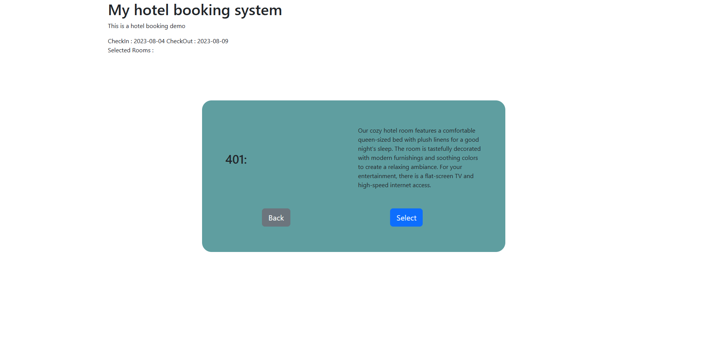

# HotelBookingWeb

## Table of Contents

1. [Description](#description)

2. [Updates](#updates)

3. [Environment](#environment)

4. [Installation / Getting Started](#installation--getting-started)

5. [DatabaseERD](#databaseerd)

6. [Features](#features)

## Description

HotelBookingWeb is a web application designed to provide an intuitive platform for users to book hotel rooms. Built with
SpringBoot, MySQL & Mybatis for the backend and HTML, CSS, JavaScript & Bootstrap for the frontend. The application
allows users to select and book available rooms based on their preferences. It also provides an admin interface for
managing rooms and tracking guest bookings.

## Updates

See [RELEASENOTES.md](RELEASENOTES.md) for details on changes in each version.

### Key Updates Version 3.0

- **Database Updates**: The database structure was updated for better extensibility. New tables were added and existing
  tables were modified to include more detailed information.

- **Service Layer Refactoring**: The service layer was refactored with interfaces and implementation, leading to
  improved maintainability and reliability.

- **User Updates**: User features were updated, including enhancements to the room booking functionality.

For a complete list of updates and improvements, please refer to the full RELEASENOTES.

### Key Updates Version 2.0

- **Frontend Overhaul**: A significant update was made to the front-end interface, improving usability and user
  experience.

- **FormValidation**: This was introduced to the front-end, ensuring users input data correctly and improving overall
  data quality.

- **BookingComplete Page**: A new page was added, providing users with a detailed summary and confirmation of their
  booking.

- **SpringSecurity with LoginForm**: Implemented for admin access, enhancing the security of the system.

For a complete list of updates and improvements, please refer to the full RELEASENOTES.

## Environment

### IDE
- IntelliJ IDEA 2022.1.1 (Ultimate Edition)

### JDK
- Corretto-17

### Dependency Management
- Gradle

### FrontEnd & UI
- HTML5
- CSS3
- JavaScript
- Bootstrap
- Template Engine: Thymeleaf

### BackEnd
- Java with Spring Boot version '3.0.2'
- Spring MVC
- Spring Security
- Mybatis
- Server: Tomcat in Spring Boot

### Database
- MySQL 8.0

## Installation / Getting Started

This is a Gradle project, you can use "build.gradle" to import the project.

### Prerequisites

- JDK: corretto-17

- MySQL 8.0

- Gradle
### Setup

1. Clone the repository to your local machine.

2. Edit the database connection settings in 'src/main/resources/application.properties' or set them as Environment Variables to match your local environment.

3. The default port is 8090. This can be changed in "application.properties" if desired.

4. "src/main/resources/data.sql" includes guest and room test cases. Edit or remove this as needed.

5. Be aware that the database will reset each time you run this project due to the query statement in "src/main/resources/schema.sql". Edit or remove this as needed.

6. Run the project using Gradle.

## DatabaseERD

## Features

### Book a room / multiple rooms 

#### Enter check_in & check_out date to check which rooms are available.

#### Select a room and check more information. Then you can select the room.(Multiple selections are available)

#### Enter guest information

#### Complete

## Check rooms database and guests database as an admin via browser.

### Admin Login Page

### Rooms database

### Guests database
You can delete orders or mark unpaid orders as paid

