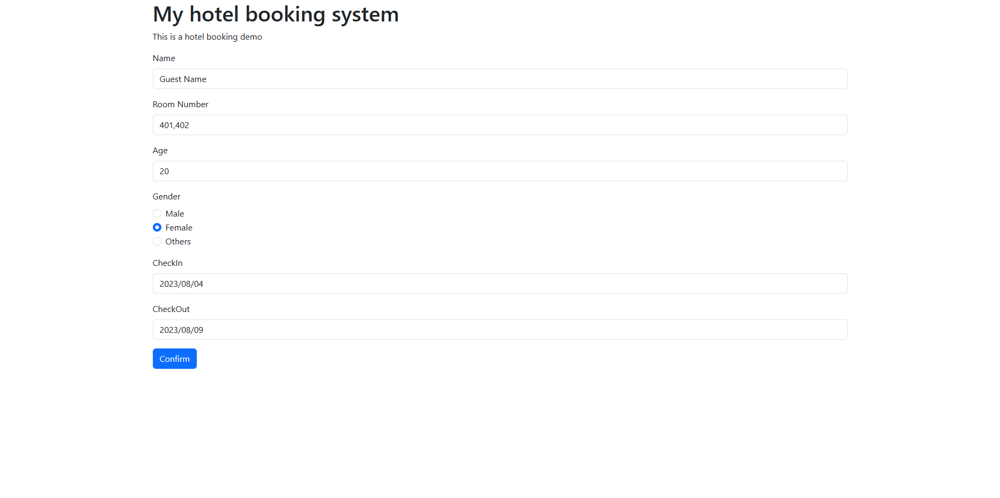

# HotelBookingWeb
A HotelBooking WebApp with SpringBoot,Mysql &amp; Mybatis ,html,css,javascript&amp;Bootstrap

## Update

2023-03-26 
Version2.0
Updated FrontEnd

2023-03-01 
Added BookingComplete page

2023-02-26 
Added buttons for admin pages for accessing between checkGuests&checkRooms pages

2023-02-24 
Added SpringSecurity with LoginForm(Admin Login Page).
Added 2 admin testcase with hashed password in database: 
Plz use testcases below to access admin pages. 
Admin ID : test1  Password: test1  
Admin ID : test2  Password: test2  
Admin login page :  
"http://localhost:8090/admin"  
Admin pages :  
"http://localhost:8090/admin/checkGuests"  
"http://localhost:8090/admin/checkRooms"  
For local env.

2023-02-19 
Added FormValidation in FrontEnd with Javascript.

## Environment

#### IDE: IntelliJ IDEA 2022.1.1 (Ultimate Edition)

#### JDK: corretto-17

#### Dependency: Gradle

#### FrontEnd & UI : 
html5 
css3 
JavaScript 
Bootstrap 
Template Engine : Thymeleaf

#### BackEnd :
Java with Springboot version '3.0.2' 
Spring MVC 
Spring Security 
Mybatis 
Server: Tomcat in springboot

#### Database

Mysql 8.0

## Run

This is a Gradle project , you can use "build.gradle" to import the project. 

Database connection setting is in "src/main/resources/application.properties" , you can edit it to  match your Env. 

Default port is 8090 in this project, you can also change it in "application.properties". 

"src/main/resources/data.sql" includes guest&room testcase, you can edit/remove it according to your needs. .

Caution: database will be reset every time you run this project because of the query statement in "src/main/resources/schema.sql", you can edit/remove it according to your needs.  
## Database

## Features

### Book a room

#### Enter check_in & check_out date, number of people to stay to check which rooms are available.

#### Select an available room and check more details

#### Enter guest information

#### Complete

### Check room_database and guests_database as an admin via browser.

### Admin Login Page

### room_database

### guests database

